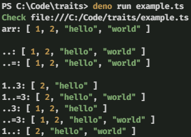

## Range

This adds a simple way to get slices of an array using a [Rust]-like syntax in
a function. Most use cases **should not** prefer to use this over the built-in
`Array.prototype.slice` method, this is just a fancy wrapper around that. But
this still does come in handy for some situations and is very flexable.

## Example

You can run the `example.ts` either by cloning the repo and running `deno run
example.ts` or by running `deno run https://deno.land/x/range/example.ts`. The
output should resemble something like what you see below:

## Tests

This module is fully tested by the the tests found in `test.ts`. Both errors
and successes are tested to make sure that the module doesn't regress. If you
do change anything, make sure that the tests pass and are modified as needed,
thanks.

[Rust]: https://rust-lang.org